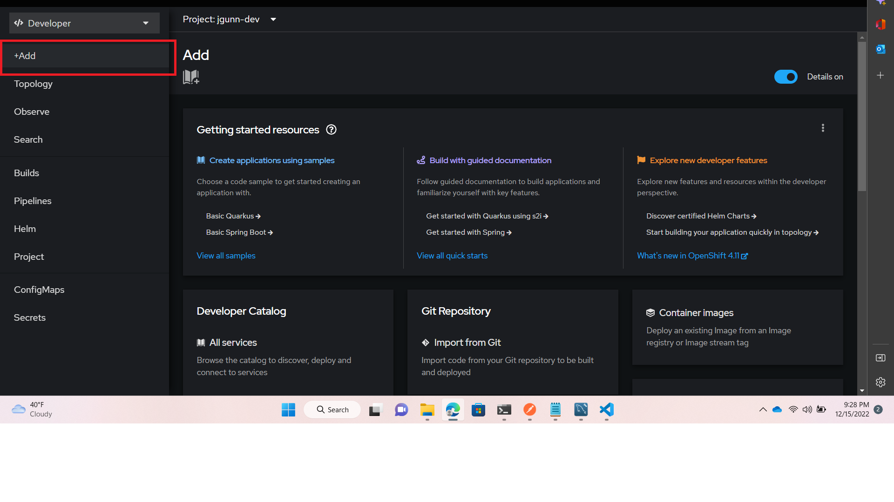

## Intent

This is a sample project to create and deploy 2 tier application into OpenShift.  It is NOT production ready and should not be considered to be production code. It is purely to demonstrate the build / deploy of dockerized applications onto a OpenShift platform.  


It is composed of 2 parts:

1. [Spring / Maven back-end](springboot-crud) - See the springboot-crud folder
1. [MySQL 8 database server](docker-mysql-8) - See the docker-mysql-8 folder


## Dependencies

1. MS Windows
1. OC Cli
1. [Java](https://access.redhat.com/jbossnetwork/restricted/softwareDetail.html?softwareId=104805&product=core.service.openjdk&version=17.0.5&downloadType=distributions) / JAVA_HOME is added to the PATH.
1. [Workbench](https://www.mysql.com/products/workbench/)
1. Postman

## Login
1. 
1. 
1. `oc login --`
 

## Useful Commands
`oc get pods`
`oc get services`
`oc port-forward <POD_NAME> 3306:3306`

## Architecture

Standard 2-tier Spring / MySQL


## First Time Process to run the application (Set-up the DB)

1. Login to the Portal
1. 
1. 
1. 
1. Database Name - `db`
1. MySQL Username - `admin`
1. MySQL Password - `123456`
1. MySQL Root Password - `123456`
1. Next set-up port forwarding so we can configure the db
1. `oc get pods wide -o wide` - make note of the db pod
1. `oc port-forward {pod} 3306:3306`
1. Open up Workbench, point at localhost:3306
1. Create some data
```
CREATE SCHEMA `employee-schema`;

CREATE TABLE `employee-schema`.`employee` (
  `emp_id` INT(11) NOT NULL AUTO_INCREMENT,
  `first_name` VARCHAR(45) NULL,
  `last_name` VARCHAR(45) NULL,
  `email_id` VARCHAR(45) NULL,
  PRIMARY KEY (`emp_id`));

INSERT INTO `employee-schema`.`employee` (`emp_id`, `first_name`, `last_name`, `email_id`) VALUES ('1', 'openshift first 1', 'first 1', 'email 1');
INSERT INTO `employee-schema`.`employee` (`emp_id`, `first_name`, `last_name`, `email_id`) VALUES ('2', 'openshift first 2', 'first 2', 'email 2');
INSERT INTO `employee-schema`.`employee` (`emp_id`, `first_name`, `last_name`, `email_id`) VALUES ('3', 'openshift first 3', 'first 3', 'email 3');
```

## Deploy the App
1. Login to the Portal
1. 
1. 
1. `docker.io/dragonspears/backend`
1. Select the app `2-tier-app`
1. Create a unique name for the `backend{}`
1. Let the image deploy
1. Try and browse to show that the image is deployed
1. Open Postman to show that we are not getting data
1. 
1. Scroll to Environment Variables
1. `spring.datasource.username` - `root`
1. `spring.datasource.password` - `123456` //this needs to match the root password that you set before
1. `spring.datasource.url` - `jdbc:mysql://db:3306/employee-schema`  //we are connecting to a service called "db"
--

## Now let's create a server level config so that others can manage

1. Click ConfigMaps
1. 
1. Click CreateMap
1. 
1. Create a name, note it... `test-configmap`
1. Call it `spring.datasource.username`
1. Paste in `root`
1. Create another key
1. Call it `spring.datasource.url`
1. Paste in `jdbc:mysql://db:3306/employee-schema`
1. Save

## Now let's create a server level secret to hide sensitive info

1. Click Secrets
1. 
1. Click Create
1. 
1. Create a name, note it... `test-secret`
1. Call it `spring.datasource.password`
1. Paste in `123456`
1. Save

## Scenarios

# Update the Deployment Replicas

1. Open up `./k8s/frontend-deployment.yaml`
1. Change the `replicas: 1` to `replicas: 4`
1. `kubectl apply -k k8s`
1. `kubectl describe deployment frontend` Review the deployment, show it has changed
1. `kubectl get pods -o wide`


