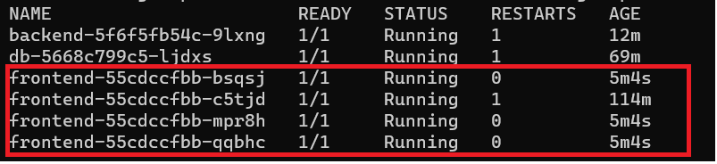

## Intent

This is a sample project to create and deploy 3 tier application into Kubernetes.  It is NOT production ready and should not be considered to be production code. It is purely to demonstrate the build / deploy of dockerized applications onto a Kubernetes platform.  

This application has only been tested on Windows 10/11.  It may work on other OS's but no guarantee.  

It is composed of 4 parts:

1. [Angular 14 front-end](docker-sample-angular) - See the docker-sample-angular folder
2. [Spring / Maven back-end](springboot-crud) - See the springboot-crud folder
3. [MySQL 8 database server](docker-mysql-8) - See the docker-mysql-8 folder
4. [K8s](k8s) - See the k8s folder.  This is where all of our Kubernetes specific deployment manifests are held


## Dependencies

1. MS Windows
1. [Java](https://access.redhat.com/jbossnetwork/restricted/softwareDetail.html?softwareId=104805&product=core.service.openjdk&version=17.0.5&downloadType=distributions) / JAVA_HOME is added to the PATH.
1. Docker Desktop
1. Docker Compose
1. Kubetctl
1. [Workbench](https://www.mysql.com/products/workbench/)
1. Postman
1. NPM

## Architecture

Standard 3-tier Angular / Spring / MySQL


## Troubleshooting commands
1.  Show info about running pod - `kubectl get pods -o wide`
1.  Show configuration about pod - `kubectl describe pod {podname / id}`
1.  Access the pod from your local machine - `kubectl port-forward {podname / id} {outside port}:{container port}` 


## First Time Process to run the application

#
Build the app - We could configure the CI to do this in an automated fashion
#
1. `git clone https://github.com/dragonspearsinc/kubernetes-3-tier`
1. `cd kubernetes-3-tier`
1. Build the frontend (this could be done by the CI) - `docker build -t dragonspears/frontend ./docker-sample-angular`
1. Build the frontend (this could be done by the CI) - `docker build -t dragonspears/backend ./springboot-crud`

#
Deploy the app
#
1. Review what will be deployed - `kubectl kustomize ./k8s`
1. `kubectl apply -k k8s` This command is similar to docker compose up and uses a simlar file called [kustomize.yaml](k8s/kustomization.yaml) which creates the pods using Kubernetes specific syntax vs. Docker
    - Note:  To remove the directory based deployment, run `kubectl delete -k k8s`

#
Setup the DB
#
1. `kubectl get pods -o wide` - Review the pods, look at how the IP's are private, non-routable, make note of the db pod name
1. `kubectl exec -it {podname} /bin/bash` 
1. `mysql -p`  //default password is `123456`
1. `update mysql.user set host = '%' where user='admin';`
1. `update mysql.user set host = '%' where user='root';`
1. `exit`  //exit the mysql
1. `exit` //exit the pod / bash
1. `kubectl delete pod {podname}`  //this will kill the pod, but don't worry, since we used a deployment, Kubernetes will automatically restart a new pod
1. `kubectl get pods -o wide` //node that the pod was restarted
1. `kubectl port-forward {podname} 3306:3306` //set-up port-forwarding so we can have access to the DB, otherwise, i have to use mysql commands within the pod itself
1. Open up Workbench, point at localhost:3306
1. Create some data
```
CREATE SCHEMA `employee-schema`;

CREATE TABLE `employee-schema`.`employee` (
  `emp_id` INT(11) NOT NULL AUTO_INCREMENT,
  `first_name` VARCHAR(45) NULL,
  `last_name` VARCHAR(45) NULL,
  `email_id` VARCHAR(45) NULL,
  PRIMARY KEY (`emp_id`));

INSERT INTO `employee-schema`.`employee` (`emp_id`, `first_name`, `last_name`, `email_id`) VALUES ('1', 'k8s first 1', 'first 1', 'email 1');
INSERT INTO `employee-schema`.`employee` (`emp_id`, `first_name`, `last_name`, `email_id`) VALUES ('2', 'k8s first 2', 'first 2', 'email 2');
INSERT INTO `employee-schema`.`employee` (`emp_id`, `first_name`, `last_name`, `email_id`) VALUES ('3', 'k8s first 3', 'first 3', 'email 3');
```
#
Test the deployment
#

Let's connect to the services.  No need to port-forward
1. `kubectl get services -o wide` - Review the services.
1. Open a *browser* to: `http://localhost:8080`


1. Open your *postman* to: `http://localhost:8080`


## Stop the application

1. `kubectl delete -k k8s`

## Scenarios

# Update the Deployment Replicas

1. Open up `./k8s/frontend-deployment.yaml`
1. Change the `replicas: 1` to `replicas: 4`
1. `kubectl apply -k k8s`
1. `kubectl describe deployment frontend` Review the deployment, show it has changed
1. `kubectl get pods -o wide`



# Update the Deployment to use external (outside K8s) DB

** Note:  This section assumes you have a mysql running external to the cluster, configured, and has data

1. Open up `./k8s/backend-deployment.yaml`
1. Change the connection string from `jdbc:mysql://db:3306/employee-schema` to `jdbc:mysql://db:3306/employee-schema`
1. `kubectl apply -k k8s`
1. `kubectl describe deployment backend` Review the deployment, show it has changed
1. Open a browser to see how the data is now changed: http://localhost:3000
